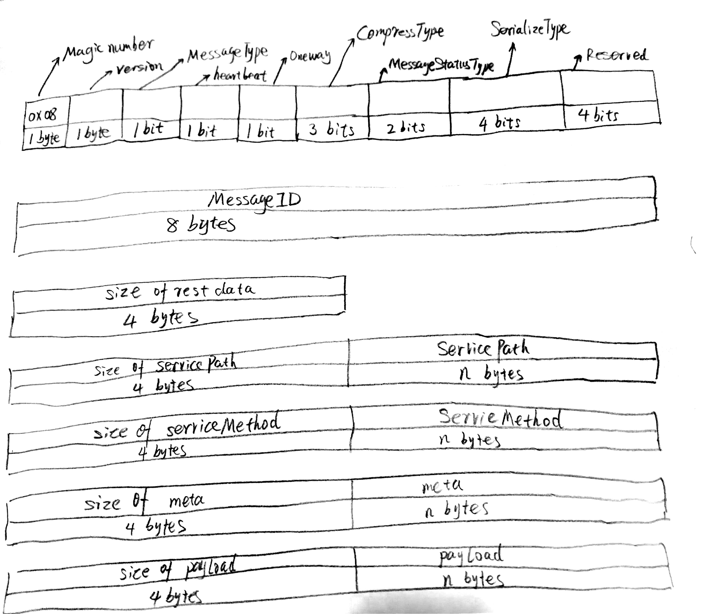

# Protocol

requests and responses of rpcx use the same message format.

One message contains:

1. Header: 4 bytes
2. Message ID: 8 bytes
3. total size: 4 bytes, doesn't contain size of header and itself, uint32
4. size of servicePath: 4 bytes, uint32
5. servicePath: UTF-8 string
6. size of serviceMethod: 4 bytes, uint32
7. serviceMethod: UTF-8 string
8. size of metadata: 4 bytes, uint32
9. metadata: format: `size` `key1 string` `size` `value1 string`, can contains multipl e=key, value
10. size of playload: 4 bytes, uint32
11. playload: slice of byte

`#4` + `#6` + `#8` + `#10` must be equal to `#3`.

`servicePath`、`serviceMethod`、`key` and `value` in metadata must be UTF-8 string.

rpcx uses `size of an element` + `element` format to define one element. It is like [TLV](https://en.wikipedia.org/wiki/Type-length-value )but rpcx doesn't use `Type` because `Type` of those elements are UTF-8 string.

Use `BigEndian` for size (integer type, int64, uint32, etc.) 

1、The first byte must be `0x08`. It is a magic number.

2、The second byte is `version`. Current version is 0.

3、MessageType can be:
  0: Request
  1: Response

4、Heartbeat: bool. This message is heartbeat message or not

5、Oneway: bool. Need return response or not.

6、CompressType:
  0: don't compress
  1: Gzip

7、MessageStatusType: indicates response is an error or a normal response
  0: Normal
  1: Error

8、SerializeType
  0: use raw bytes
  1: JSON
  2: Protobuf
  3: MessagePack

If one service fails to handle requests, it can return an error. It sets MessageStatusType of response is `1` (ERROR) and sets the error message in metadata of the response. The key for the error is **__rpcx_error__**, and the value is error message.

